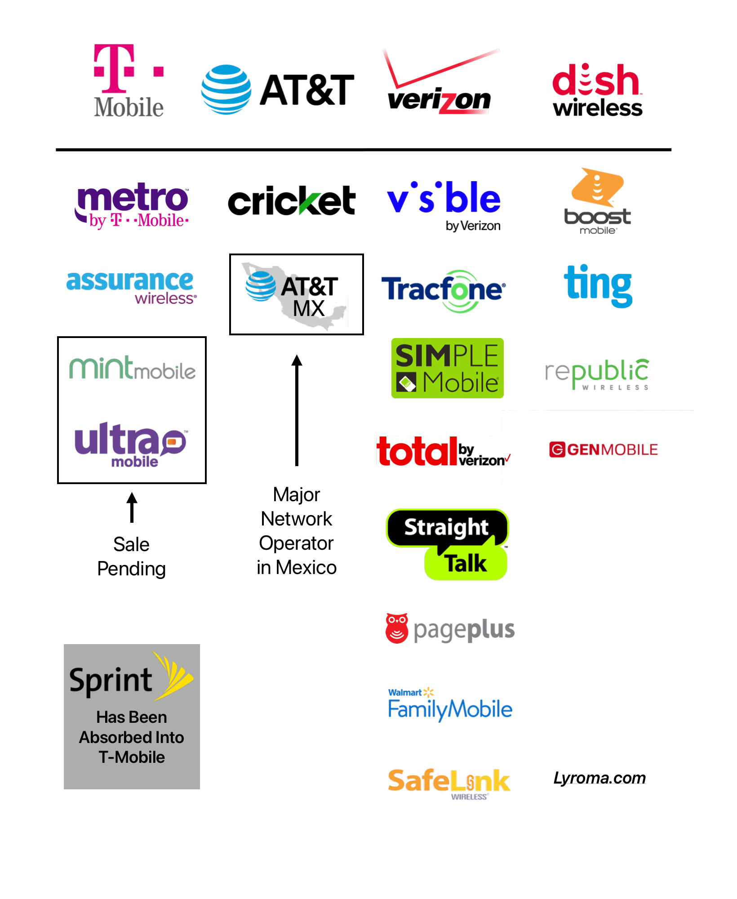

---
weight:
title: "The Big 4 Cell Phone Companies Post Mint Mobile Sale"
subtitle:
summary: What The Big 4 Looks Like After The Ka’ena Sale
date: 2023-03-16
lastmod: 2023-03-16
draft: false
author: "Don Silvio"
description: "What The Big 4 Looks Like After The Ka'ena Sale"
url: "/big-four"
lightgallery: true
toc:
  auto: false
hiddenFromHomePage: false
hiddenFromSearch: false
linktoMarkdown: false
comment: true
categories: ["U.S Market"]
tags: ["Ka'ena", "Mint Mobile", "Ultra Mobile", "T-Mobile"]
resources:
- name: "featured-image"
  src: "img/big-4-plus-mint.jpg"
- name: "featured-image-preview"
  src: "img/big-4-plus-mint.jpg"  
--- 

# Let's Paint The Picture

I only want to show what the Big 4 will potentially look like if the Ka’ena Corporation sale to T-Mobile goes through. 

Mint Mobile and Ultra Mobile for 1.35 Billion! OMG! Who exactly was T-Mobile bidding against???

---

--

---

*This thing of ours...* 

Share the article if you liked it!

If you have something you want to say, please leave a comment. 

Please consider a small [contribution](https://lyroma.com/contribute) if you benefited from this article. It's not required but even the smallest contribution helps out.

---

-- **Don Silvio**

---

*Featured Photo by... ME!*

