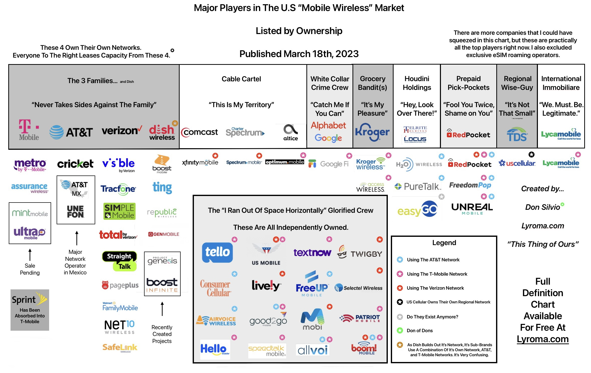

---
weight:
title: "The U.S Mobile Wireless Market As Of Today"
subtitle:
summary: After All The Recent Consolidations/Buyouts/Mergers, This Is A Big Picture Overview Of The U.S Mobile Wireless Market.
date: 2023-03-18
lastmod: 2023-03-18
draft: false
author: "Don Silvio"
description: "After All The Recent Consolidations/Buyouts/Mergers, This Is A Big Picture Overview Of The U.S Mobile Wireless Market."
url: "/commission-report"
lightgallery: true
toc:
  auto: false
hiddenFromHomePage: false
hiddenFromSearch: false
linktoMarkdown: false
comment: true
lightgallery: true
categories: ["U.S Market"]
tags: ["Verizon", "AT&T", "Dish", "T-Mobile"]
resources:
- name: "featured-image"
  src: "img/weekly-meeting.jpg"
- name: "featured-image-preview"
  src: "img/weekly-meeting-1.jpg"  
--- 

## The Commission Report

The last few years have been quite busy for cellular carriers both large and small. Many carriers have been consolidated/bought-out/merged with another, it can be confusing to know which carrier is owned by who. Worry not my friend, I have graciously put together a chart showing what is what. Don't mind the titles I gave to these companies, I'm only having a little fun. *Pure Satire.*

---

A full definition PDF is available [here](https://send.ephemeral.land/download/4a8179c7b2101cb9/#OirXeFyOSbg_uUWT6asP2g).

---

---

--

---

*This thing of ours...* 

Share the article if you liked it!

If you have something you want to say, please leave a comment. 

Please consider a small [contribution](https://lyroma.com/contribute) if you benefited from this article. It's not required but even the smallest contribution helps out.

---

-- **Don Silvio**

---

