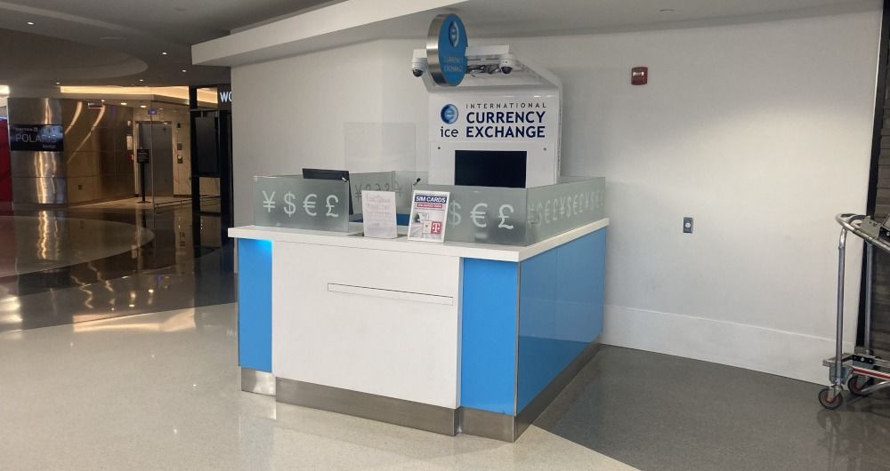
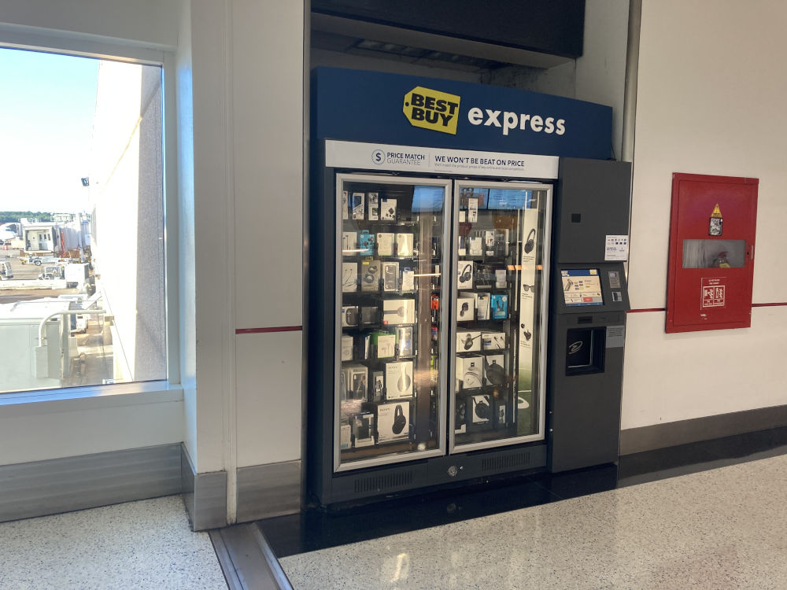
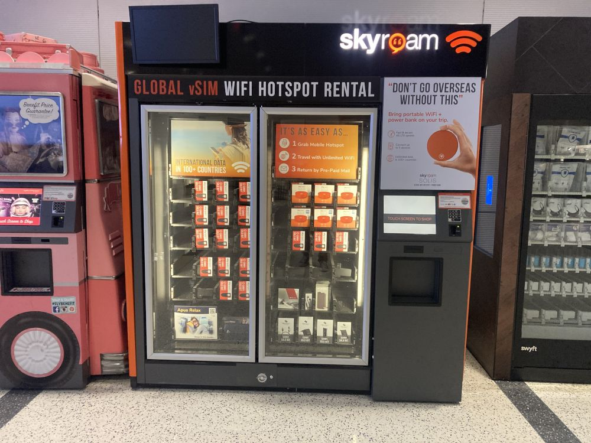
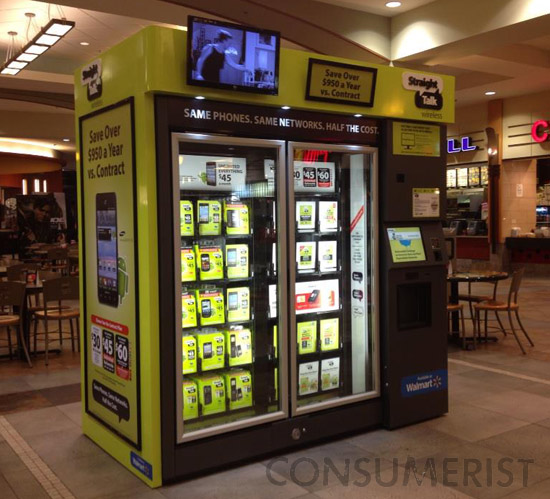
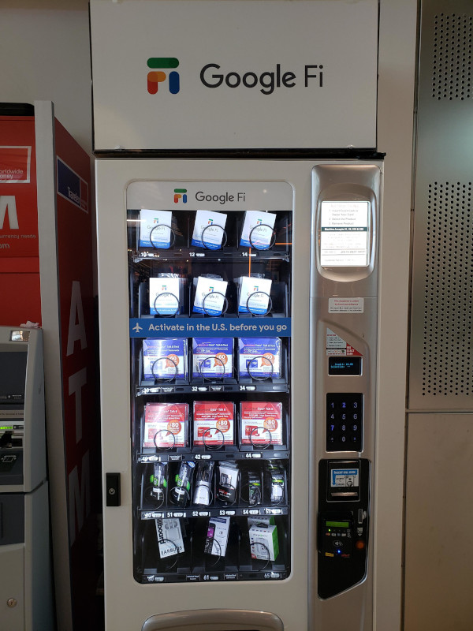
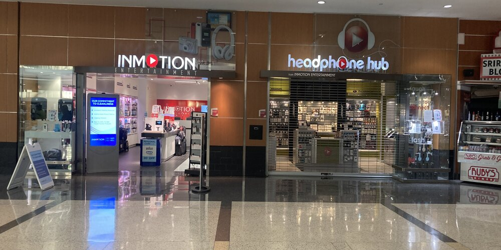
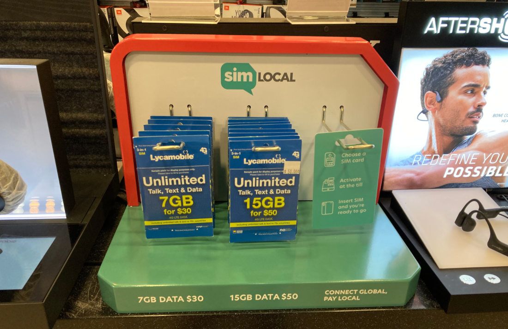

# How To Buy A SIM Card At The Airport, In The USA

 

{}
Updated September 27, 2021. Everything in this article has been verified by Don Silvio firsthand, *no buffers*. There is zero payment or influence being given or asked for. No one is paying for or reviewed this article before posting. The information below does not apply to airport locations outside the "Mainland" USA. Nothing is copied or regurgitated information, everything is up to date.
{}

## Introduction
In this article/guide, there will be information about everything anyone would need to know about buying and activating a SIM card, with full working service at an airport in the United States for usage in the United States. Finding, buying, and activating will all be covered here. This article will be about what is most accessible to the maximum amount of international visitors to the USA.

The trend seems to be that if anyone asks about purchasing SIM cards at the airport, **SPECIFICALLY** in the USA, the response will be that it is either "not possible", "prohibitively expensive", or "better options outside the airport". Admittedly, once outside the airport a person will have a much higher variety of products at lower prices. This is true, but it is also true, that some would simply prefer to purchase a SIM card at the airport.  

Not only have new options arrived but there has been a convenient and affordable option for years. Buying and activating a local SIM card at the airport is THE MOST CONVENIENT option when arriving at any country, aside from having a SIM card with roaming features with you beforehand. 

The issue is when people ask this question, the people who answer are mostly those who have never tried, never had a reason, and will never have a reason to do so. This topic warranted its own [article](https://lyroma.com/Prepaid-Wireless-And-The-Average-American) about the mindset of the "Average" American when it comes to Prepaid Wireless in the USA. The demand for this service is there, as it is there for virtually every other country in the world outside the USA. 

Another reason someone may want a SIM card immediately (especially one with international calling features) upon arriving is to call back to their loved ones that they landed safely. Not everyone is on Skype or WhatsApp, or the airport Wi-Fi may, uhh... suck.

Time to get to the information you came here for.

## 1. Currency Exchange Booths

This is where you can exchange currencies upon arriving at an airport. Some of these booths sell prepaid SIM cards, but in reality they usually have

1. Inconsistent hours open and staffed
2. Inconsistent prices
3. Inconsistent choices
4. Inconsistent inventory on hand
5. Inconsistent customer service

As you can see if you do run into one of these that is indeed staffed when you walk up to it, have a SIM card in stock, at an acceptable price, and the customer service is even aware that they sell them, it might be a good option. You should buy a lottery ticket immediately afterwards. 

Currency Exchange Booths are just too inconsistent across the board to be relied upon.

Though from what I've run into, T-Mobile and LycaMobile SIM cards seem like popular products offered at these booths.

## 2. Vending Machines/Kiosks

From unmanned vending machines to small kiosks. These seem like they would be the easiest and most likely method to acquire a SIM card, unfortunately that is not the case.

### [Best Buy Express](https://bestbuy.com)

When it comes to these machines selling SIM cards, it seems that it is hit or miss, leaning towards not having them. There is photographic evidence of these machines stocking SIM cards from T-Mobile, H2O Wireless, SIMTraveler.com, and some other brands to blurry to tell definitively. They have also stocked Virgin Mobile prepaid phones and H2O mobile hotspots. An international calling card also it seems. Those are all from the past though with the some of these photos and videos going back 10+ years. The latest photo seems to be from this one, it is from an online review, posted October, 2018, here by Mark ------, it is selling a T-Mobile Tourist SIM card for $30. That specific SIM has only been offered since June 2016. IAH and LAX . A way to check the inventory at any given kiosk is unknown at this time, most likely unable to so. So the Best Buy kiosks have sold them and may still carry SIMs from time to time but they are inconsistant.

### [Skyroam](https://skyroam.com)

This company provides wireless hotspots/mofis for rent and purchase. There is no way to order service for a phone or other devices besides the companies own hardware. No SIM cards are offered as a standalone product. To find a location worldwide, click [here](https://www.skyroam.com/where-to-buy).

### [Straight Talk](https://straighttalk.com)

*Picture by [Consumerist](https://consumerist.com)*

Straight Talk put out a [blog post](https://blog.straighttalk.com/straight-talk-automated-retail-shops/) about these kiosks in 2013. There have been some reports of sightings, nothing in the past 5 years it seems. It is unknown if these have been discontinued. 

A YouTube [video](https://www.youtube.com/watch?v=n7A7WCuME_k) of someone finding it in the wild.

### [Google Fi](https://fi.google.com)

*Picture by [u/johnnyplato on Reddit](https://www.reddit.com/r/GoogleFi/comments/dvv34x/spotted_a_fi_vending_machine_at_jfk_airport/)*

The [reported](https://www.reddit.com/r/GoogleFi/comments/dvv34x/spotted_a_fi_vending_machine_at_jfk_airport/) sightings of these machines are more recent. There is no list of locations and seemingly no public acknowledgement by Alphabet/Google that these machines exist.

### Other Local Small Business's That Sell SIM Cards
These seem to exist in some capacity in the USA. Products offered, customer service, price, and locations available, can all range from awful to excellent. The website of the airport might list some of these stores in their shop directory. It seems to be the best way of finding out if an airport has a certain store in it.

Example 1 -

The Newark airport in New Jersey lists a kiosk named ["SIMs On The Go"](https://www.jfkshopdine.com/directory/cell-phone-SIMs-on-the-go-jfk-terminal-8-t8/). It is listed as "temporarily closed". Running that name in a online search engine yields little relevant results. No website, no hours of business, no contact phone number, nothing.

Example 2 -

The LAX airport in Los Angeles lists a ["Virgin Mobile/Boost Mobile"](https://www.flylax.com/lax-dining-and-shopping-details?id=d4d8c048-1757-4848-8c28-ea1bf0745b09) kiosk, also "temporarily closed". They have listed hours and a contact phone number though.

Example 3 -

The McCarren Airport in Las Vegas lists a ["SIM Cards - Vending"](https://www.mccarran.com/Maps) (type in "SIM cards" in the search bar and it should appear) vending machine. The only thing known about this vending machine from the listing is the specific location in the airport in which it is located. Nothing more.

## [3. Inmotion Stores USA](https://www.inmotionstores.com/)

InMotion is an electronics retailer with stores inside airports across many states in the US. They sell LycaMobile and Ultra Mobile SIM cards. These stores are not in some random airports, they are predominantly in airports most frequented by travelers on both international and domestic flights. They include 120+ total locations in 44 airports, 26 states, and Washington DC. InMotion being in *"only"* 26 states is not as much as an issue as you might think, for example an international arrival is likely not going to fly direct into Alabama. In the case that someone's final destination is Alabama, they're likely to transit through one of the airports that does have an InMotion store.

Here is a list of [locations.](https://www.inmotionstores.com/location#United-States)

This article has always been about what is most accessible to the maximum amount people. InMotion stores at the current moment have everything that the other 2 airport options are lacking.

This article will contain a snippet of information about InMotion Stores. To read a full detailed breakdown of Prepaid Wireless options at InMotion Stores, click here.

By the time this article is released these options should be at all, if not most locations. Though, it never hurts to double-check and confirm hours and availability before arriving that a certain airport location. Stores do not have the same hours of operation, it's important to check that the location will actually be open upon your arrival. Especially if you are transiting through that airport and have no time to waste.

Click the location [finder](https://www.inmotionstores.com/location#United-States) and select the airport you will be arriving at, then narrow down which terminal you will be arriving at. InMotion does not make it clear which locations are at the "International Arrivals Terminal" and once you past security it can be difficult if not impossible to get past security again. Research on your own which terminal you will be arriving at and check if there is going to be an InMotion store near your arriving terminal.

I find https://www.ifly.com/ to be a helpful resource when researching individual airports, their maps, and which terminals are which. Though it is still best to call ahead and confirm that the location is not temporarily closed or anything.

If you have any questions about the SIM cards or concerns about availability, do not hesitate to call any one of the locations at the airport you will be arriving at, beforehand. For example, Inmotion stores can share products across locations (within the same airport), so if the location you want to buy the SIM card at is out-of-stock, then with a little notice they can move that SIM to your desired location. The point is, if you will be relying on this then it doesn't hurt to check beforehand.

Also, something to keep in mind, is that the InMotion employees, I've found, to be "sufficiently" knowledgeable, when it comes to activating the SIM cards for you if you need help doing so. From my experience, if they attempt to activate the SIM card and fail to get it to work with your phone. They will give you a refund or try again. Your mileage may vary.

### [LycaMobile SIM Cards](http://www.lycamobile.us/en/)

*Prices are in USD*

--

{}
LycaMobile operates in over 20+ Countries as its own MVNO, unique to that Country. Make sure when researching LycaMobile you research the proper division. For example not looking at the UK site [lycamobile.co.uk](lycamobile.co.uk) for USA information found on [lycamobile.us](lycamobile.us), and especially not LycaMobile Uganda @ [lycamobile.ug](lycamobile.ug).
{}

LycaMobile (USA) SIM cards are provided at InMotion stores via partnership with SIM Local. Be on the lookout for 3 different kinds of displays. No matter the display type all options should be available.

The SIM Cards sold are a $30 and $50 Package.

| Allowance | $30 | $50 |
| -------- | -------- | -------- |
| USA-USA **Minutes**     | Unlimited     | Unlimited     |
| USA-USA **Text Messages**     | Unlimited     | Unlimited     |
| International **Minutes** to 75+ Countries from the USA    | Unlimited     | Unlimited     |
| International **Text Messages** to 75+ Countries from the USA    | Unlimited     | Unlimited     |
| Data (Internet)     | 7GB     | 15GB     |
| Bonus International Credit     | Unknown     | Unknown     |

| Feature | $30 | $50 |
| -------- | -------- | -------- |
| Wi-Fi Calling     | Yes     | Yes     |
| Mobile Hotspot (Tethering)    | Yes     | Yes     |

Both SIM cards come preloaded with a month of service from the date you activate the card (not the date you purchase it). So if you wanted, you could wait a few days or weeks to activate the SIM card and not lose any days of service.

Once the SIM card has been purchased, activating is simple. You have 3 options on how you want to activate. 

1. **Call 622** - Easiest and usually activates in under 5-10 minutes, start to finish, only 1 device is required when activating. 24hr automated service.
2. **Online** - Pretty annoying with so much you have fill out. Usually activates in under 10 minutes, start to finish. It is 10x more work versus option 1.
3. **Call Customer Service** - You have 2 options who to call for customer service, SIM Local or LycaMobile. Time estimates vary wildly. 
 * SIM Local **+1 (888) 617-3221** "24hr toll-free number" though if you call outside the UK call center hours of 9am-5pm British Standard Time, then expect "lower tier service".
 * LycaMobile **+1 (866) 277-3221** multilingual Customer Service that operates from 11:00 to 20:00 EST. Mon-Sat, closed on Sunday.

For this guide we are going over option 1 (Call 622) and that you want a **New** USA phone number.

1. Insert the SIM card into your phone
2. Open the phone dialer and place a call to 622
3. When prompted, enter the desired ZIP code you wish the phone number to be associated with. (SIM Local Provides a default New York City ZIP code of **10154**)
4. The SIM card should now start activating, this can range from 1 minute to 30 minutes. Though, usually it will not take more than 5 minutes.
5. That's it

You now have an activated prepaid LycaMobile SIM card with 1 month duration.

### [Ultra Mobile SIM Cards](https://ultramobile.com)

Ultra Mobile SIM cards have been provided in InMotion stores for at least 3 years. In my experience, they do not seem to have any dedicated display. They could be on shelf hanging somewhere or behind the counter. Either way, simply asking the Salesperson if they have any Ultra Mobile SIM cards in stock should suffice. The 2 packages available are a $27.99 and a $39.99 package.

| Allowance | $27.99 | $39.99 |
| -------- | -------- | -------- |
| Minutes     | Unlimited     | Unlimited     |
| Text Messages     | Unlimited     | Unlimited     |
| International Calling to 80+ Countries     | Unlimited     | Unlimited     |
| Data (Internet)     | 2GB     | 5GB     |
| Minutes     | Unlimited     | Unlimited     |
| Minutes     | Unlimited     | Unlimited     |
| Minutes     | Unlimited     | Unlimited     |

Both SIM cards come preloaded with a month of service from the date you activate the card (not the date you purchase it). So if you wanted, you could wait a few days or weeks to activate the SIM card and not lose any days of service.

Once the SIM card has been purchased, activating is simple. You have 4 options on how you want to activate. 

1. **Text 6700** - Easiest and usually activates in under 5-10 minutes, start to finish, only 1 device is required when activating. 24hr automated service.
2. **[Online](http://www.ultramobile.com/activate)** - Easier than LycaMobile but still more steps than option 1. Usually activates in under 10 minutes, start to finish. It is 5x more work versus option 1.
3. **[Online Chat](http://www.ultramobile.com/)** - Easy chat help, usually activates in under 10 minutes, start to finish, only 1 device is required when activating. Open 7 days a week, 6AM to 6PM PST.
3. Call Customer Service - **+1 (888) 777-0446** Open 7 days a week, 6AM to 6PM PST. Time estimates vary wildly. 

For this guide we are going over option 1 (Call 622) and that you want a **New** USA phone number.

1. Insert the SIM card into your phone
2. Open the phone dialer and place a call to 622
3. When prompted, enter the desired ZIP code you wish the phone number to be associated with. (SIM Local Provides a default New York City ZIP code of **10154**)
4. The SIM card should now start activating, this can range from 1 minute to 30 minutes. Though, usually it will not take more than 5 minutes.
5. That's it

You now have an activated prepaid Ultra Mobile SIM card with 1 month duration.

## LycaMobile Vs. Ultra Mobile
{}
This is only a comparison of the 4 plans offered at InMotion. This is **NOT** a Carrier comparison. Only some differences and similarities will be listed.
{}

-- *prices in USD*

What to consider when choosing between these two options. First of all, both Carriers use the T-Mobile Network, so for the most part, performance should be the roughly the same in that regard.

First let's compare what the 2 Carriers have in common across all 4 package option.

| Allowance | LycaMobile | Ultra Mobile |
| -------- | -------- | -------- |
| Unlimited USA-USA **Minutes**     | Yes     | Yes     |
| Unlimited USA-USA **Text Messages**     | Yes     | Yes     |

| Feature | LycaMobile | Ultra Mobile |
| -------- | -------- | -------- |
| Wi-Fi Calling     | Yes     | Yes     |
| Mobile Hotspot (Tethering)    | Yes     | Yes     |

Both Carriers offer international roaming (the ability to use your service **outside** the USA, in the traditional sense).
The rates you will have to pay will be in addition to your monthly plan rate.

Example - For LycaMobile, if you wanted to use your service outside the USA with your $30 plan, then your base cost would be $30 a month **+** whatever you use on a PAY-AS-YOU-GO basis. The funds for usage internationally must be loaded onto your account before usage. Not recommended for long term or heavy usage, there are better Carriers for such use cases.

Now the **MAIN** differences -
| Carrier + Plan | Data (Internet) |
| -------- | -------- |
| **Ultra Mobile** $27.99     | 2GB     |
| **LycaMobile** $30.00     | 7GB     |
| **Ultra Mobile** $39.99     | 5GB     |
| **LycaMobile** $50.00     | 15GB     |

So when it comes to data allowances/price, LycaMobile is the clear choice. 

### Native International Calling/Texting from the USA

LycaMobile and Ultra Mobile both provide unlimited international calling/texting to multiple Countries. 

LycaMobile - "75+" Countries included

- Most of Europe
- Some of the Americas
- Some of Asia
- Very Few of Africa

Ultra Mobile - "80+" Destinations included

- Most of Europe
- Some of the Americas
- Some of Asia
- Very Few of Africa
- Australia & New Zealand

I have found, in my expirience, that Ultra Mobile is the easier of the two to find up-to-date information about without having to contact customer service. Their website is clearer about information in general. Both have an online chat service, your milage may vary with both services.

