# AT&T Pay-As-You-Go Plans: Activation Tutorial

 

-- *Updated January 21st, 2022 with breaking news.*

{}
As of January 5th, 2022

AT&T has retired their Pay-As-You-Go plans. It is no longer possible to sign up as a new customer with these plans.

For a [discussion](https://www.reddit.com/r/NoContract/comments/ry2cgf/att_to_retire_payasyougo_plans_effective/) on the matter.

This post will remain up for archival purposes.
{}

# Introduction

Do you want to use AT&T service but don’t want to forgo your life savings in exchange? I am here to tell you that you don’t have to. AT&T has long offered affordable Pay-As-You-Go plans in addition to their normal monthly plans. With the advent of the “Unlimited Everything” way of selling service in the USA, Pay-As-You-Go plans across all Carriers have diminished. This has not deterred AT&T from continuing to offer these plans as many still rely on their service.

- $2 Daily Plan

- 25¢ Minute Plan

In this post I’m going to go over everything you need to know about the AT&T Pay-As-You-Go plans and how to activate them. 

## The Basics

The way Pay-As-You-Go works in theory is exactly as it sounds. You only pay for what you use and in its prepaid iteration you must have the available funds before you use them. Each call, text, and other billable activities have their own “fee” which gets deducted from from your balance that you previously funded. If there are no funds, there is no service.

Refill Requirements are imposed to keep the account active and profitable for the Carrier. This is done by placing a limit on how much time certain refill amounts can fund an account for. The more the refill amount the more time the account is allowed to be active.

Rollover is a concept that means, what you don’t use gets rolled over to the next cycle. There are 2 types of rollover that can exist in prepaid Pay-As-You-Go plans. The first is balance rollover where so long as you fulfill the refill requirements then your balance will rollover, and be added to your total account balance. The second type of rollover is usage rollover, where if you don’t use some item that you already paid for, then that item gets rolled over into the next cycle.

All these concepts exist in AT&T’s two plans to some degree. Let’s get into the details now.

## Similarities Between Plans

>AT&T offers two Pay-As-You-Go plans. These plans are a 25¢ Minute Plan and a $2 Daily Plan. Both can be activated in-store, online or by calling Customer Service.

Both of AT&T’s Pay-As-You-Go plans share the following similarities.

### Refill Requirements

You must fulfill one of the following refill schedules to keep the account active. If you fail to meet these deadlines then your service will stop working and eventually canceled. How this works, is that refill amounts can only fund the account for *up-to* a certain amount of time.

- $10-$24 - **30 Days**
- $25-$99 - **90 Days**
- $100-$500? - **365 Days**

Adding funds to your account adds time from the date you added the funds. It does not extend the time you have left. Example - if you still had 15 days left, and you add $10 today. You will now have 30 days of service going forward. You will not have 45 days. This could save you some potential grief. Speaking from experience. 

### Balance Rollover 

So long as you refill your account at the appropriate time-frames your account balance will roll over indefinitely, up-to a limit. I don't know exactly what the upper limit is as I've never had more than $400 in my account at any given time.

### Supplemental Features

- Standard Wi-Fi Calling
- Roaming in Mexico & maybe Canada as well
- ESIM Eligibility

### Examples

John refills his account by $10. His account balance is now $10 and has 30 days of service. He uses his account a little and has reduced his balance to $8. On day 29, John refills his account by $25. His account balance is now $33 and now has 90 days of service. During this time he does not have any billable activity, so his account balance has remained at $33. On day 89 he refills $100 and now has an account balance of $133 and has 365 days of service.

Maria refills her account by $100. Her account balance is now $100 and has 365 days of service. Maria forgets about her refill deadline and on day 366 her service is cut-off and will remain as such until she refills *at least* $10. She decides not to refill her service and allows her service to be canceled.

Michael refills his account by $15. His account balance is now $15 and has 30 days of service. He uses his account a lot and has reduced his balance to $2. On day 29, Michael refills his account by $65. His account balance is now $67 and now has 90 extra days of service. 44 days later Michael has managed to reduce his balance to $7, so he refills early and funds his account by $300. He now has an account balance of $307 and now has 365 days of service.

## 25¢ Minute Plan

This plan is the truer iteration of a Pay-As-You-Go plan out of the two.

- *Incoming Texts* - **20¢**
- *Incoming Calls (Answered)* - **25¢/minute**
- *Incoming Calls (Unanswered/Sent to Voicemail)* - **FREE**
- *Outgoing Texts* - **20¢**
- *Outgoing Calls (Answered)* - **25¢/minute**
- *Outgoing Calls (Unanswered/Sent to Voicemail)* - **25¢**
- *Outgoing Calls (To your own voicemail)* - **25¢/minute**
- *Data Usage* - **Disabled, though available as an Add-On**

You get charged for everything with this plan, as expected. If you end up getting spam texts then those texts could deplete your balance pretty quickly if not monitored.

## $2.00 Daily Plan

This plan functions as a $2 daily unlimited plan. You will receive unlimited talk and text for 24 hours once you actually use the service. Use the service??? What does that mean? It means that the second any billable activity occurs... $2 gets deducted from your balance, and for the next 24 hours you have unlimited talk and text allowances. If you do not trigger a billable activity then you will not get charged the $2 fee. Not everything is a billable activity, so it's possible you may not *ever* get charged the $2 fee.

You do not have access to data on this plan by default, you have to purchase it when you actually want to use it. This can be beneficial as you will not be charged by some random data connection on your phone.

- *Incoming Texts* - **FREE**
- *Incoming Calls (Answered)* - **Triggers the $2 fee**
- *Incoming Calls (Unanswered/Sent to Voicemail)* - **FREE**
- *Outgoing Texts* - **Triggers the $2 fee**
- *Outgoing Calls (Answered)* - **Triggers the $2 fee**
- *Outgoing Calls (Unanswered/Sent to Voicemail)* - **Triggers the $2 fee**
- *Outgoing Calls (To your own voicemail)* - **Triggers the $2 fee**
- *Data Usage* - **Disabled, though available as an Add-On**

---

You can see how incoming calls and text are FREE. They do not deduct anything from your balance. Only if you respond to the text or answer the call, will you then trigger the $2 fee. 

## How to Activate

AT&T recently changed how you are able to activate prepaid plans in general. It used to be the case that all you needed to do is pop the SIM card into the phone, dial an activation code, and you were up and running in 5-10 minutes. This method has been used by myself for as long as I can remember. I think the last time I activated this was was in early 2020, maybe late 2019. No internet connection required, no second device, it used to be so easy. The good old days. 

Now... AT&T wants you to input your IMEI during the activation process to verify compatibility with its network. Not the end of the world but it makes the activation more of a headache than required. Oh well... no sense pouting, lets continue with the methods that work right now.

As it is AT&T, there are still multiple ways to activate. Some methods to directly activate the plans without any workarounds include

- **Calling AT&T Customer Service** - This requires having a way to call them as the SIM cannot dial 611 without service. Some agents are more helpful and knowledgeable than others, it may require a few attempts to get an agent who knows what they are doing and actually opens the account properly. 
- **Activating at a Corporate AT&T Store** - They should still be able to activate these plans, technically speaking. I can report success in a corporate store in activating the 25¢ Minute Plan, I just did it the other day. The sales-person may not be aware of existence of these plans and may not be to keen to help. Insist the plan is an option on their iPads, it's there. They may not have ever activated the plan themselves, this is okay as once they find the plan on their iPad it becomes a standard activation. What about non-corporate stores you might be thinking? Good luck... that's all I'll say about that.

Lets move on to some other ways of activating the plans.

The other ways to activate the Pay-As-You-Go plans utilize the "Downgrade Method".

### Downgrade Method???

Any Single Line AT&T Prepaid plan can be converted to another in quick and easy fashion. From what I've experienced, it is easier to downgrade ***from*** a monthly plan ***to*** a Pay-As-You-Go plan, rather than activate those plans straight out. I know what you're thinking, you're thinking, *"Great, so this guy is saying I have to pay for a monthly plan and then downgrade to paygo plan... what does he think, that I'm made of money?"*

No... and neither am I. 

Which reminds me, that if by the end of this guide you have benefited at all and feel compelled to do so, please consider a small [contribution](https://lyroma.com/contribute). I work on this site as a 1-man hobby project. Anyway... back to the guide!

When an AT&T Prepaid account is first activated it must complete 2 major steps. 

- The first step is - **Opening the account**
This is where IMEI Verification and choosing a plan occurs. This step always comes first, and you cannot continue forward without completing this step.

- The second step is - **Funding the account**
This is where you have to actually pay for the plan that you chose in step one. Once this occurs, your account is alive and active.

**BUT...**

An AT&T Prepaid Account can exist in a state of limbo for a period of time. It is possible to complete step 1 without completing step 2. During this state of limbo, you are given a phone number and can create an online login for your account. Once you have your AT&T number... you have an account and can receive help and preform standard account actions like any other AT&T Prepaid customer. This includes "downgrading" the plan you chose in step 1 to any other plan. Either from the online dashboard or through customer service. 

This is **not** a glitch or hack, it is like this by design, and has been like this for as long as I can remember. AT&T wants your money, and they are giving you time to fund your account. They keep the account in this state for I think... 30 days. Don't quote me on this though, I truly don't know. But it is enough time to arrange a payment for your newly created account. I think the longest I kept an account in limbo was probably 2 days. 

Once you have downgraded your plan to a Pay-As-You-Go plan, you would then proceed with funding your account by credit/debit or PIN code.

You should now have fully activated service.

That's the "Downgrade Method" in a nutshell.

---

Anyway...

The following methods are self-service and utilize the "Downgrade Method"

- **Calling The Automated Activation Service**

This method allows you to complete step 1 without requiring you to finish with step 2. You can choose literally any monthly plan and then proceed with the "Downgrade Method".

- **Using The Online Activation Portal**

This method will also allow you to complete step 1 without requiring you to finish with step 2. Same process as above, choose any plan and proceed with the "Downgrade Method".

## Step-By-Step Activation Tutorial

For this Tutorial I will be using the **online activation portal**, which utilizes the "downgrade method" and activating the $2 Daily Plan. 

### Before You Buy Anything

You will require a compatible phone for activation. A lot of older phones and international models are being rejected by AT&T. Make sure the phone you use for activation is supported. Look at this [whitelist](https://www.att.com/idpassets/images/support/wireless/Devices-Working-on-ATT-Network.pdf) for supported phones on AT&T. I expect this list to be outdated pretty quickly so don't consider it the end-all-be-all. Unfortunately AT&T's does **NOT** have an IMEI checker to verify compatibility. This mostly applies to non-iPhones, if you have a recent iPhone (after iPhone 6) you should be good.

There is a method to verify your IMEI with AT&T's **online activation portal**, though you will need a valid non-activated SIM card to check. So for our purposes, I would recommend acquiring a SIM card first, run your IMEI, and if all good... then purchase your refill card (does not apply if you're using credit/debit). If you want to check your phone then read a little further and complete only step 1 of the activation as that will tell you if your phone is supported. Practically a mock or trial activation before the real thing.

### What You Will Need

- **An AT&T SIM card.** 

You can purchase what you see above at retail stores, online, you name it. Some stores that sell the SIM card are Best Buy, Walmart, and Target. Depending on where you get it, it can cost $1-$20. Most retail stores sell them for $10.

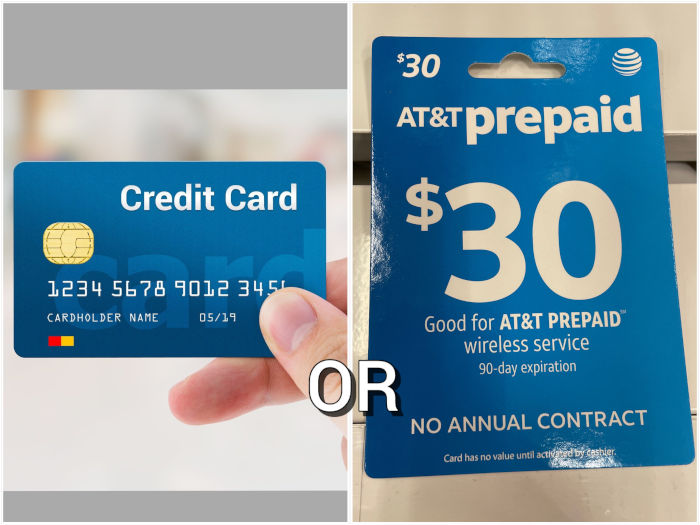

- **A Way to Pay.**

Either credit/debit or PIN code. PIN codes via refill cards can be purchased at the same retail stores that sell the SIM cards. PIN codes can also be purchased online on many sites. A minimum of $25 is required to activate the plan.

### Let's Get Started

Give the tutorial a read and understand what is happening before you attempt it yourself. I don't foresee issues, but it's better to be confident before attempting yourself.

Have the following information ready -

- **SIM card ICCID** - The number on the SIM card

---

---

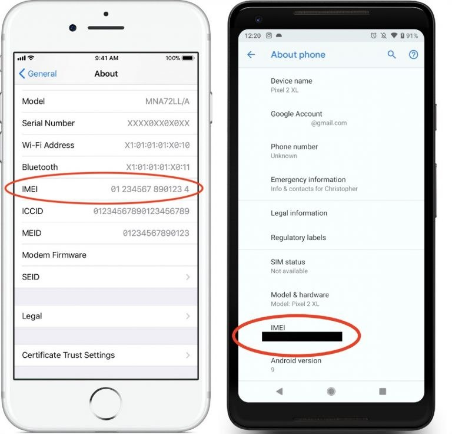

*- image from the swappa [blog](https://swappa.com/blog/how-to-check-esn-imei-meid/)*

---

- **Phone IMEI** - Look in your phone settings

---

And...

---

- **An Email Address** - For your AT&T Prepaid Account

### Step 1

Navigate to the AT&T **online activation portal** 

https://www.att.com/prepaid/activations/

Enter your SIM ICCID, IMEI number, ZIP code, and passphrase.

### Step 1.A

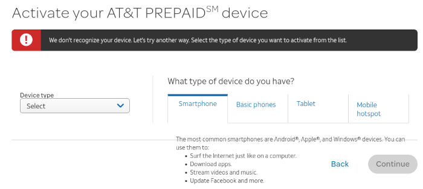

*If you do **not** see this screen then proceed to step 2.*

If you encounter this error screen then your phone is **NOT** supported on the AT&T network according to AT&T.

It is still possible to activate your SIM card and open your account **with** your *"unsupported device"*. Your phone ***may*** stop working after Feb, 2022. Proceed at your own risk. I assume no responsibility if you spend money and waste time opening the account and in the end not have working service.

I encountered this error myself using the IMEI of a modern international android phone and by the end I have working talk and text service.

### Step 1.B

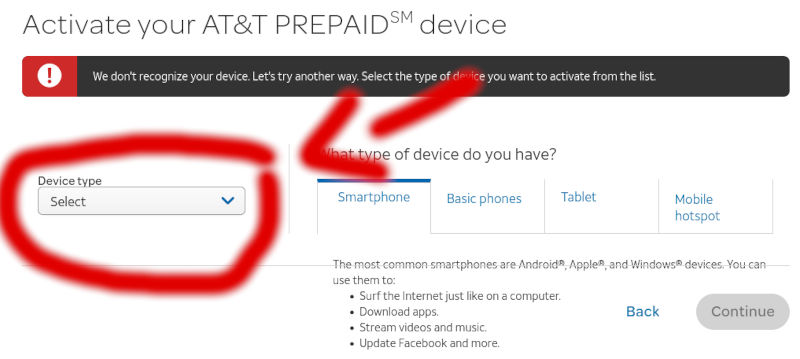

From the drag-down selector choose "Smartphone" and press "Continue"

You may now proceed to step 2.

### Step 2

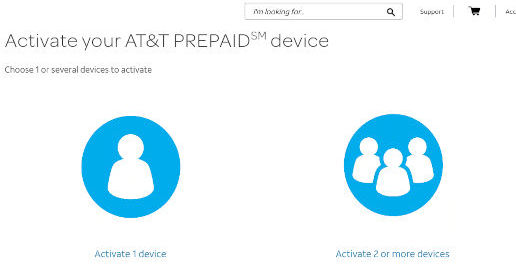

Select "Activate 1 Device"

### Step 3

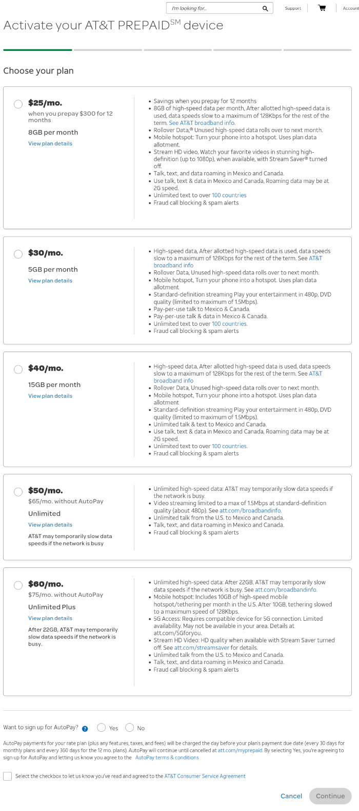

You will now be brought to a screen where you can choose a monthly plan.

**DON'T WORRY**

This is expected and part of the "Downgrade Method".

---

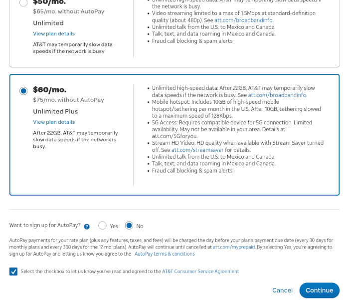

Choose any plan as you won't actually have to pay for it.

Here I chose the "$60/mo." plan.

Choose whether you want AutoPay or not, I chose "No".

Agree to the terms of service and press "Continue".

### Step 4

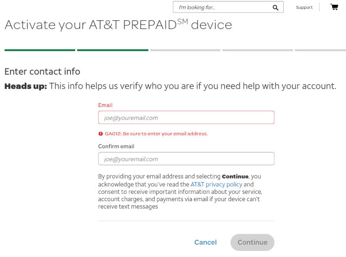

This is the last step before the completion of "Step 1 of the Downgrade Method". After this step you will receive an AT&T Number. This is your last chance to back out before you register an account with AT&T. With that said, let's continue.

Enter the email you want tied to your AT&T account. Then press "Continue".

### Step 5

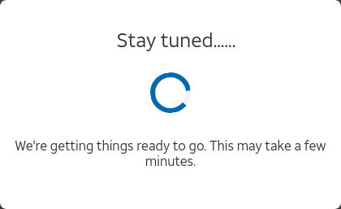

Stay Patient. Your account is being created.

Leave the screen alone and just wait for it to finish.

In my case I think it took a solid minute or two.

### Step 6

Congratulations you have completed step 1 of the "Downgrade Method" and have successfully created an AT&T Prepaid Account! Give yourself a round of applause!

Now AT&T wants your money, but wait... we have to downgrade our plan first, so follow my instructions.

### Step 7

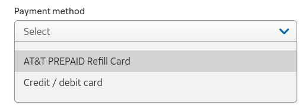

Select "AT&T PREPAID Refill Card" as your Payment Method, **even if** you intend to fund your account with a credit/debit card.

### Step 8

Now type in 1111111111

That is ten 1's.

Like this.

Then press "Continue"

### Step 8.A

---

You will receive an error, this is fine. 

Now repeat and type in 1111111111 again.

Like this.

Then press "Continue"

### Step 9

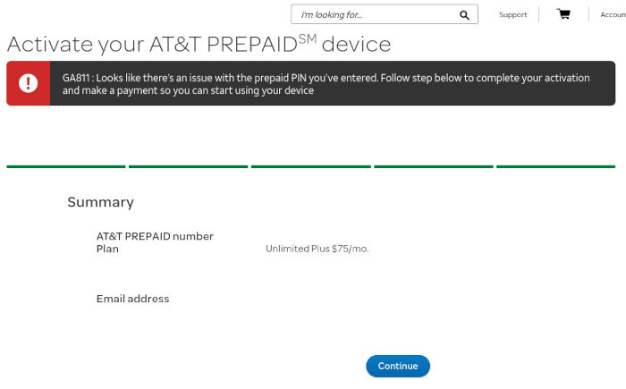

You will receive the error again but at this point AT&T realizes that maybe you have an issue with your payment method and will give you an opportunity fund your account later. 

AT&T will give you your phone number here, go ahead and write it down somewhere.

Press "Continue".

### Step 10

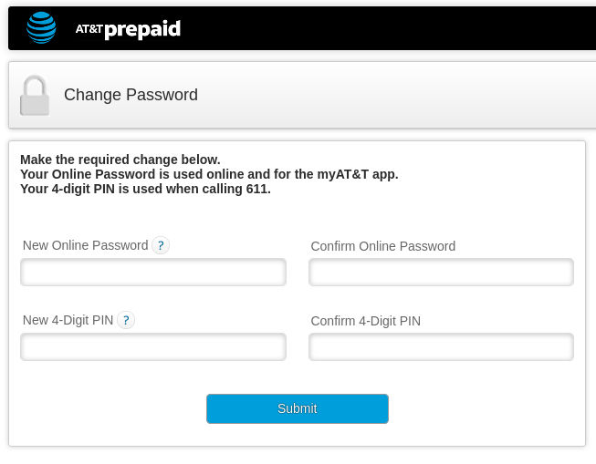

You are now presented a page to create an online password and a 4 digit PIN for your account.

Enter your information and press "Submit"

### Step 11

Success!

Press "OK"

### Step 12

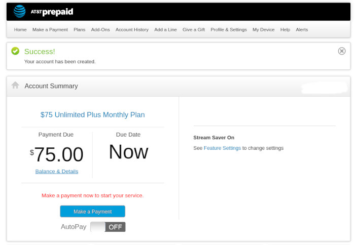

You are now in your account dashboard.

As you can see here I have a payment of $75.00 that is due **NOW**.

Before we pay anything we are going to change our plan.

Click on the "Plans" option in the menu bar.

### Step 13

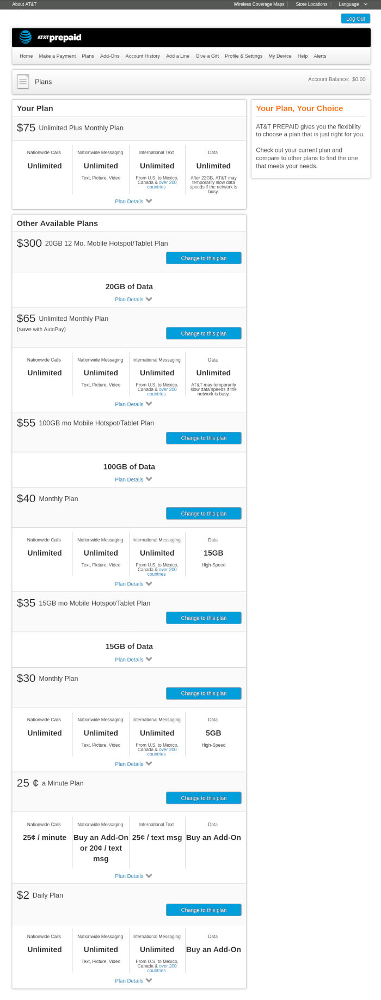

You are now presented with various plans that you can switch to.

Including the **Pay-As-You-Go** plans!

---

I chose the $2 plan.

Click on "Change to this plan" for the plan that you want.

### Step 14

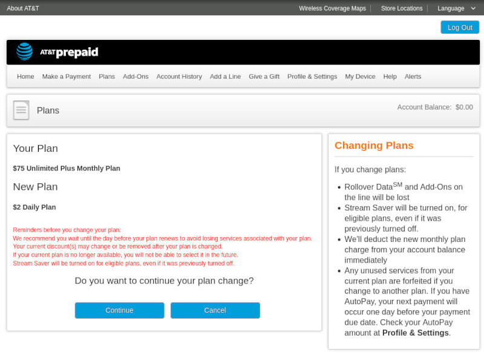

Here you will confirm your plan change

Click on "Continue"

### Step 15

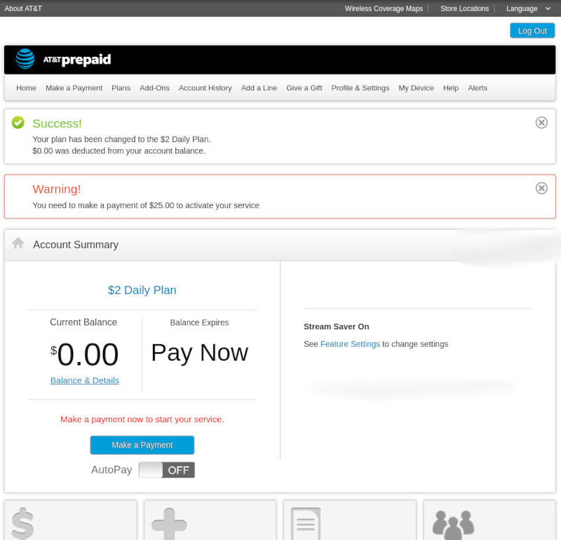

"Success! Your plan has been changed to the $2 Daily Plan."

We've done it! We have one final step to accomplish before having a fully activated account.

Click on "Make a Payment"

### The Final Glorious Step!

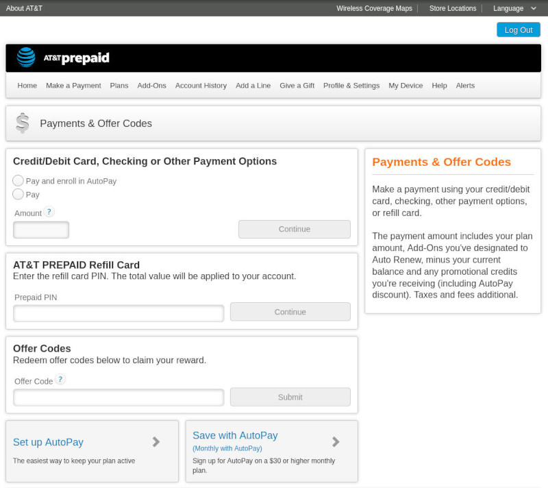

Make your payment and press "Continue"

I'm using a PIN code from a Refill Card.

### ...

The account is now fully activated!

You can insert your SIM card into your phone now and within a few minutes you should receive a couple "welcome" texts from AT&T.

## Conclusion

We just learned that AT&T still has Pay-As-You-Go plans and that they are a great value compared to today's unlimited plans. I walked you through activation and a quick run down of the rates and features. Kind of a shame that AT&T no longer promotes these plans as I think many people can benefit from them. 

Oh well, I am happy to be able to share this information with you all.

Which plan did you end up activating?

---

--

---

*This thing of ours...* 

Share the article if you liked it!

If you have something you want to say, please leave a comment. 

Please consider a small [contribution](https://lyroma.com/contribute) if you benefited from this article. It's not required but even the smallest contribution helps out.

---

-- **Don Silvio**

---

*Featured Photo by... ME!*

